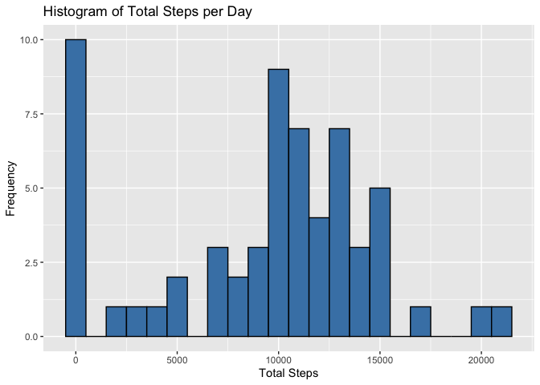
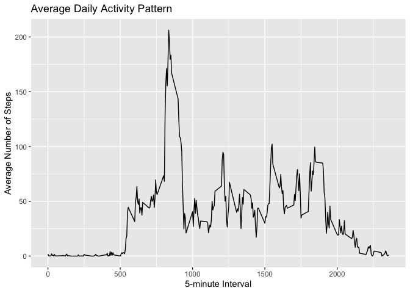
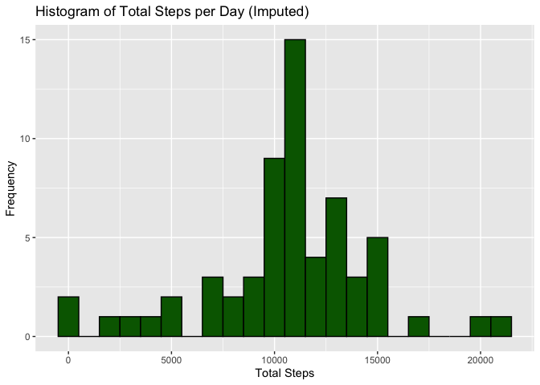
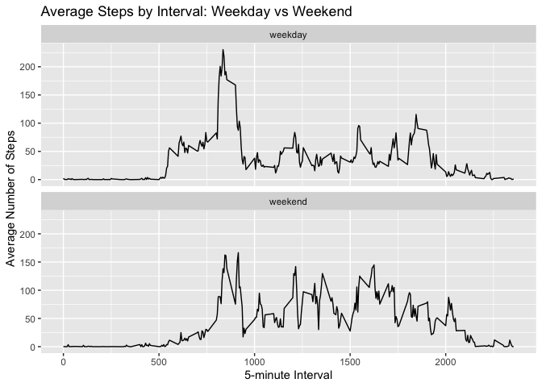

```r
knitr::opts_chunk$set(echo = TRUE)
library(ggplot2)
library(dplyr)
```

## 1. Data Loading and Preprocessing

Read the dataset and convert dates to Date class:

```r
activity <- read.csv("~/Desktop/activity.csv", stringsAsFactors = FALSE)
activity$date <- as.Date(activity$date, "%Y-%m-%d")
head(activity)
```

```
##   steps       date interval
## 1    NA 2012-10-01        0
## 2    NA 2012-10-01        5
## 3    NA 2012-10-01       10
## 4    NA 2012-10-01       15
## 5    NA 2012-10-01       20
## 6    NA 2012-10-01       25
```
## 2. Histogram of Total Steps per Day

Calculate and plot the total number of steps taken each day (ignoring NAs):

```r
total_steps <- activity %>%
  group_by(date) %>%
  summarize(total_steps = sum(steps, na.rm = TRUE))

ggplot(total_steps, aes(x = total_steps)) +
  geom_histogram(binwidth = 1000, color = "black", fill = "steelblue") +
  labs(title = "Histogram of Total Steps per Day",
       x = "Total Steps", y = "Frequency")
```

<!-- -->
## 3. Mean and Median Number of Steps per Day

Compute the mean and median of daily totals:

```r
mean_steps <- mean(total_steps$total_steps)
median_steps <- median(total_steps$total_steps)
mean_steps  # Mean total steps per day
```

```
## [1] 9354.23
```

```r
median_steps  # Median total steps per day
```

```
## [1] 10395
```
## 4. Time Series Plot of the Average Number of Steps

Determine the average daily activity pattern across 5-minute intervals:

```r
interval_steps <- activity %>%
  group_by(interval) %>%
  summarize(avg_steps = mean(steps, na.rm = TRUE))

ggplot(interval_steps, aes(x = interval, y = avg_steps)) +
  geom_line() +
  labs(title = "Average Daily Activity Pattern",
       x = "5-minute Interval", y = "Average Number of Steps")
```

<!-- -->
## 5. 5-minute Interval with Maximum Average Steps

Identify which interval has the highest average steps:

```r
max_interval <- interval_steps[which.max(interval_steps$avg_steps), ]
max_interval  # Interval and corresponding average steps
```

```
## # A tibble: 1 × 2
##   interval avg_steps
##      <int>     <dbl>
## 1      835      206.
```
## 6. Strategy for Imputing Missing Data

Imputation strategy: Replace missing steps values with the mean for that 5-minute interval (preserves the daily pattern).

```r
num_missing <- sum(is.na(activity$steps))
num_missing  # Total number of missing values
```

```
## [1] 2304
```

```r
activity_imputed <- activity %>%
  left_join(interval_steps, by = "interval") %>%
  mutate(steps = if_else(is.na(steps), avg_steps, steps)) %>%
  select(-avg_steps)
```
## 7. Histogram after Imputation

Recalculate daily totals and plot:

```r
total_steps_imputed <- activity_imputed %>%
  group_by(date) %>%
  summarize(total_steps = sum(steps))

ggplot(total_steps_imputed, aes(x = total_steps)) +
  geom_histogram(binwidth = 1000, color = "black", fill = "darkgreen") +
  labs(title = "Histogram of Total Steps per Day (Imputed)",
       x = "Total Steps", y = "Frequency")
```

<!-- -->

```r
mean(total_steps_imputed$total_steps)
```

```
## [1] 10766.19
```

```r
median(total_steps_imputed$total_steps)
```

```
## [1] 10766.19
```
## 8. Panel Plot: Weekday vs Weekend Activity Patterns

Classify days and compare average interval patterns:

```r
activity_imputed <- activity_imputed %>%
  mutate(
    day_of_week = weekdays(date),
    day_type = if_else(day_of_week %in% c("Saturday", "Sunday"), "weekend", "weekday")
  )

interval_daytype <- activity_imputed %>%
  group_by(interval, day_type) %>%
  summarize(avg_steps = mean(steps))
```

```
## `summarise()` has grouped output by 'interval'. You can override using the
## `.groups` argument.
```

```r
ggplot(interval_daytype, aes(x = interval, y = avg_steps)) +
  geom_line() +
  facet_wrap(~ day_type, nrow = 2) +
  labs(title = "Average Steps by Interval: Weekday vs Weekend",
       x = "5-minute Interval", y = "Average Number of Steps")
```

<!-- -->
